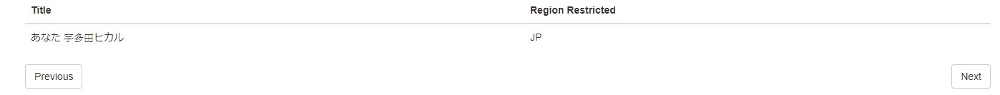
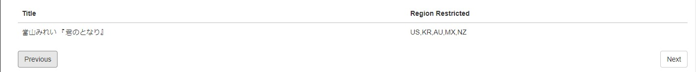

# NET-youtuberegionchecker

`*IMPORTANT*: The website is just for learning purposes and is currently not a well done website.`

YoutubeRegionChecker is a website that allows users to check if the youtube video is blocked in certain countries. This is noticeable especially with music vidoes released by Japanese Music Corporation (Sony Music Japan, Victor Entertaiment, Kings Record, Johnny's Entertainment, etc). The project is build with React Frontend + Redux + .NET backend and the API originates from [Youtube Data API](https://developers.google.com/youtube/v3/).

To run the application, open the project in Visual Studios or Jetbrain Rider, build and run the project. 

Access the web application at `http://localhost:3000`.

Some Screenshots of the Web page:

RegionChecker Page

Note: 

1. The website is still in developing stage. SVG Image is broken